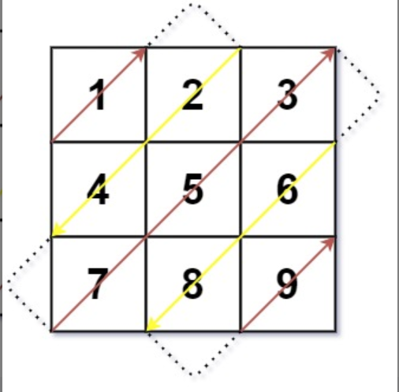

# 对角线遍历

## 问题描述
给你一个大小为 m x n 的矩阵 mat ，请以对角线遍历的顺序，用一个数组返回这个矩阵中的所有元素。

## 示例

### 示例 1：


```
输入：mat = [[1,2,3],[4,5,6],[7,8,9]]
输出：[1,2,4,7,5,3,6,8,9]
```

### 示例 2：

```
输入：mat = [[1,2],[3,4]]
输出：[1,2,3,4]
```

## 提示

- m == mat.length
- n == mat[i].length
- 1 <= m, n <= 104
- 1 <= m * n <= 104
- -105 <= mat[i][j] <= 105

## 解题思路

### 问题分析
对角线遍历矩阵的特点是元素按照从左上到右下的对角线方向依次遍历，并且相邻对角线的遍历方向相反（右上→左下→右上→...）。

### 算法设计
1. **初始化变量**：结果列表、当前行索引、当前列索引、遍历方向标记
2. **遍历过程**：
   - 从矩阵左上角(0,0)开始
   - 根据当前方向移动指针
   - 遇到边界时改变方向并调整指针位置
   - 直到遍历完所有元素
3. **边界处理**：
   - 右上方向遇到顶部边界：向右移动一列，改变方向为左下
   - 右上方向遇到右侧边界：向下移动一行，改变方向为左下
   - 左下方向遇到左侧边界：向下移动一行，改变方向为右上
   - 左下方向遇到底部边界：向右移动一列，改变方向为右上

### 时间复杂度和空间复杂度
- **时间复杂度**：O(m*n)，其中m和n分别是矩阵的行数和列数。每个元素只被访问一次。
- **空间复杂度**：O(1)，除了存储结果的空间外，只使用了常数级别的额外空间。

### 代码实现关键点
1. **方向控制**：使用布尔值标记当前遍历方向（右上或左下）
2. **边界检测**：在每次移动前检查是否遇到边界
3. **指针调整**：根据边界情况和当前方向正确调整行、列指针
4. **异常处理**：添加输入验证，确保矩阵格式正确

