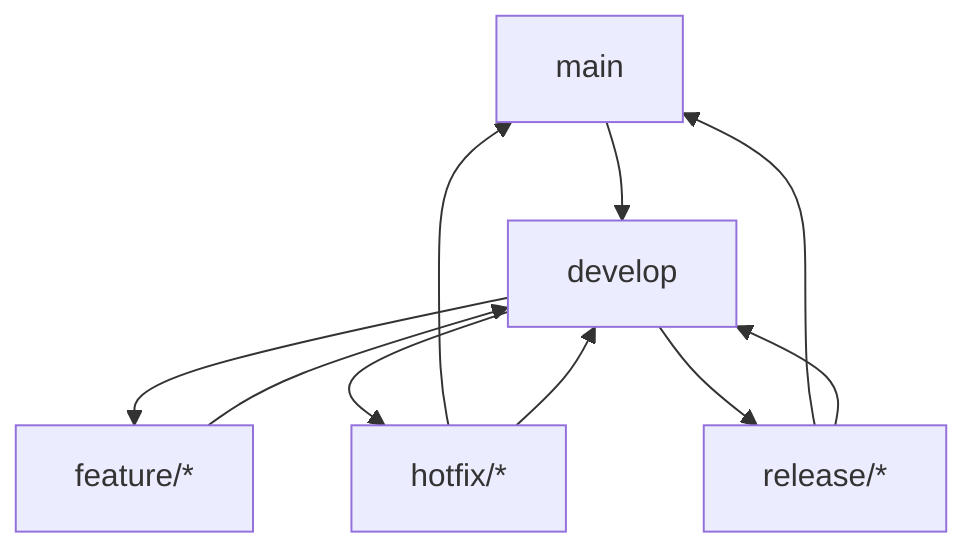

# Git 工作流规范

## 1. 分支管理

### 1.1 分支命名
- 主分支：`main`
- 开发分支：`develop`
- 功能分支：`feature/功能名称`
- 修复分支：`hotfix/问题描述`
- 发布分支：`release/版本号`

### 1.2 分支策略


## 2. 提交规范

### 2.1 提交信息格式
```
<type>(<scope>): <subject>

<body>

<footer>
```

### 2.2 提交类型
- `feat`: 新功能
- `fix`: 修复 bug
- `docs`: 文档更新
- `style`: 代码格式
- `refactor`: 重构
- `test`: 测试相关
- `chore`: 构建过程或辅助工具的变动

### 2.3 示例
```
feat(auth): 添加用户登录功能

- 实现用户名密码登录
- 添加 JWT 认证
- 集成 Redis 缓存

Closes #123
```

## 3. 代码审查

### 3.1 审查清单
- [ ] 代码符合项目规范
- [ ] 测试覆盖率达到要求
- [ ] 文档已更新
- [ ] 无安全漏洞
- [ ] 性能符合要求

### 3.2 审查流程
1. 创建 Pull Request
2. 等待审查
3. 根据反馈修改
4. 获得批准后合并 